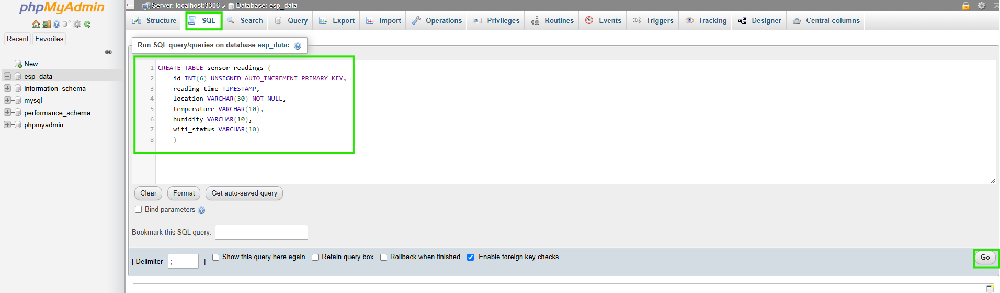
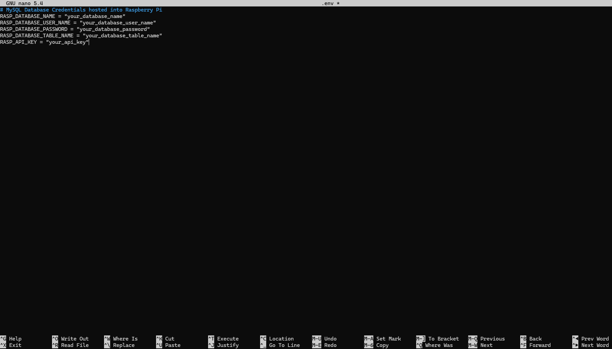
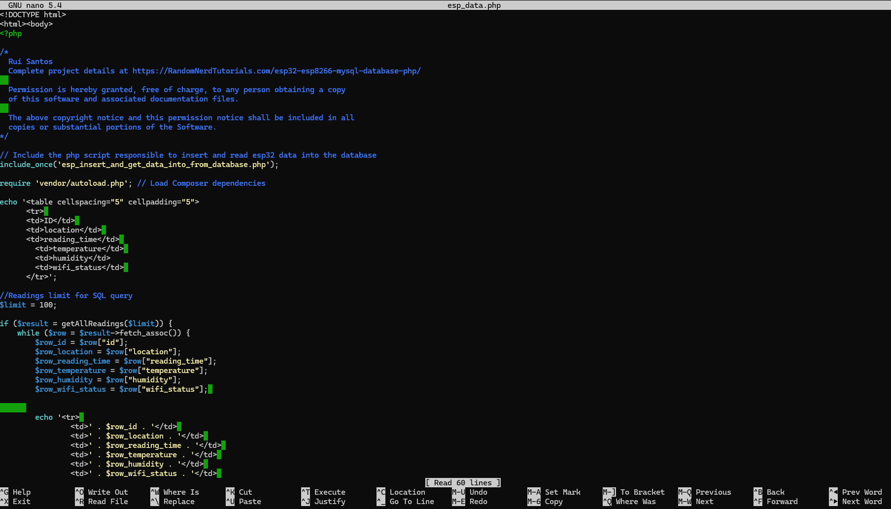
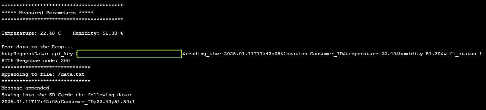
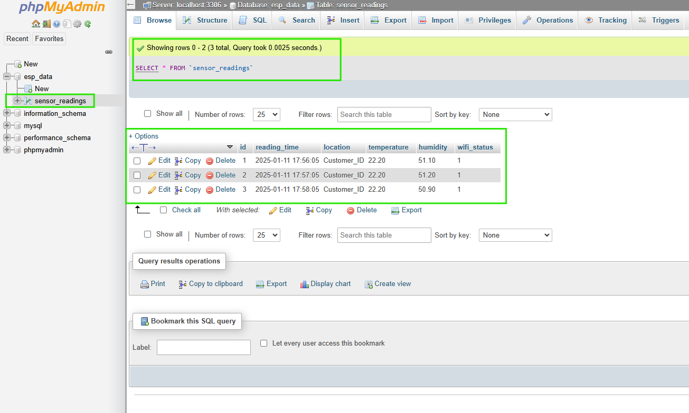
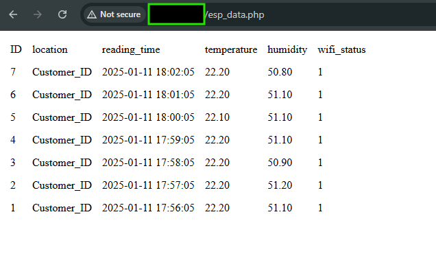
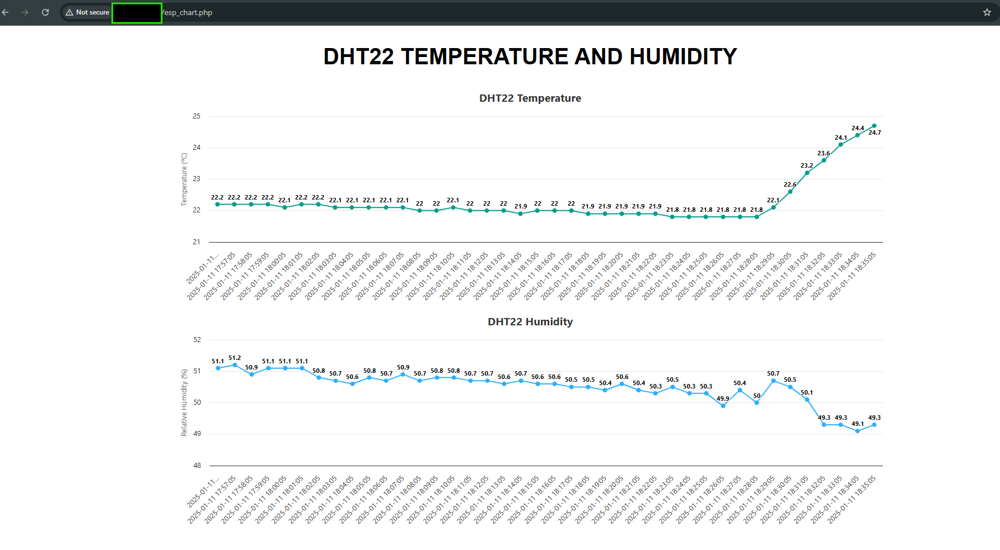
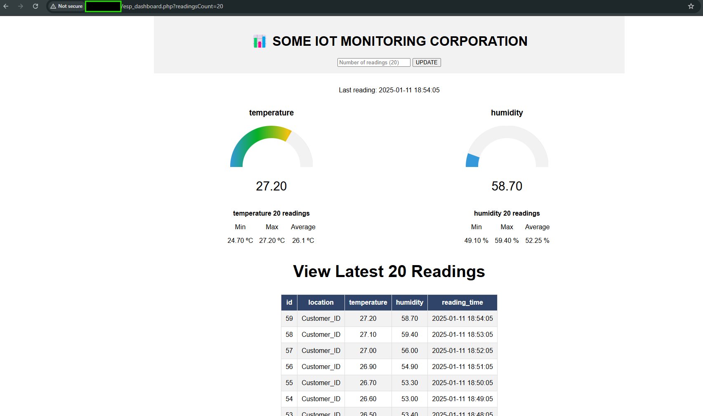

# SENDING ESP32 DATA TO A LAMP SERVER WITH RASPBERRY PI

## Under Construction...

## Description

This repo was a practice experiment based on the awesome material presented by [Random Nerd Tutorials](https://randomnerdtutorials.com/esp32-esp8266-raspberry-pi-lamp-server/)

After setting up a LAMP server using a Raspberry Pi as shown in [this tutorial](https://randomnerdtutorials.com/raspberry-pi-apache-mysql-php-lamp-server/) and also reviewed [here](https://github.com/vgmariucci/Setting_Up_LAMP_Server_With_Raspberry_Pi), we can build some **php** scripts/APIs to receive data from an ESP32 using **HTTP** protocol and **POST** method

## Requirements and Modifications to test this Repo

1- ESP32 WROOM developer board (DOIT ESP32 DEVKIT V1)

2- Raspberry Pi (3 B+)

3- Inclusion of a .env file to store sensible info used to grant access to applications.

4- Install **php**, **composer**, and **vlucas/phpdotenv** library into the Raspberry Pi to use .env file info. 

Note: If you've already set up the LAMP server into Raspberry, then install **composer** only.

**commands**

raspberrypi_user@your_raspberrypi_IP: ~ $ sudo apt install php

raspberrypi_user@your_raspberrypi_IP: ~ $ sudo apt install composer

raspberrypi_user@your_raspberrypi_IP: ~ $ sudo composer require vlucas/phpdotenv

## ESP32 Circuit Setup Used in this Project

The complete circuit is composed by following components and modules:

- DOIT ESP32 DEVKIT V1
- DHT22
- SD Card Module
- Oled Display SSD1306
- Real Time Clock Module (RTC DS3231)
- 2 Push Buttons
- 3 10 kohm resistors

The circuit setup is shown below:

### Circuit Functionality

This circuit monitors the DHT22 sensor readings at intervals, adjusted directly in the firmware (this could be improved to be adjustable in the future, using a menu approach just to set the main parameters of the system). The DHT22 readings are logged into an SD Card accompaining some other parameters like the RTC date and time, localization of installation, etc. The same data logged into the SD Card is sent using the HTTP POST method to the LAMP server running in the Raspberry Pi, which saves the data into a MariaDB/MySQL database.

The project was developed using **Arduino IDE 2.3.4** and all sketches are found in **arduino_files** directory.

## Accessing the phpMyAdmin to Create the Database to Store the Data from ESP32

Once we have the LAMP server installed and running in Raspberry Pi, we can access the server address by typing in the browser the following:

**http://you_raspberypi_IP_address/phpmyadmin**

When you press Enter, the access page will be shown:

To get access, you must fill out the field **Username** (generally **root**) and the **Password** you set during the LAMP server installation. If everything goes nicely you will see the following page:

Click on **New** to create a new database:

Choose a database name and then click in **Create**:

You will see a new database with the name you gave to it:

Now, we need to create a table to store all the ESP32 data in a structured manner(columns). To do so, we can click on the tab **SQL**:

Then, type in or just copy and paste the following SQL commands to create our desired table and click **Go**:

~~~
    CREATE TABLE sensor_readings (
    id INT(6) UNSIGNED AUTO_INCREMENT PRIMARY KEY,
    reading_time TIMESTAMP,
    location VARCHAR(30) NOT NULL,
    temperature VARCHAR(10),
    humidity VARCHAR(10),
    wifi_status VARCHAR(10)
    )
~~~

You'll see the message below and the newly created table:

If we click on the table, we can see its columns. The table is empty because no data has been inputted or sent yet.

## Creating The Files Responsible to Deal With The Data Sent By The ESP32

Now, we will create the files on the server side, which will be responsible for receiving the data coming from ESP32 via the HTTP POST method and saving it into the database. To do this, open the terminal and follow the steps below.

- Connect to the Raspberry Pi through ssh:

    **command** 
    
    ssh raspberrypi_user@your_raspberrypi_IP

    In my case, the **raspberrypi_user = pi** and **your_raspberrypi_IP = raspberrypi** or you may replace with the actual IP number address like 192.168.*.** and so on.

- Go to the following directory:

    **command**

    pi@raspberrypi:~ $ cd /var/www/html

- Create the **.env** file to store the credentials and other sensible information about the system using **nano** text environment:

    **command**

    pi@raspberrypi:/var/www/html $ sudo nano .env

    You will see the screen below:

    

    Create the environment variables we will call in *php* scripts
    which will connect with the database and store the API_KEY we will generate to have some security level between the ESP32 and the LAMP server running on the Raspberry PI.

    So, in the .env file you will enter the following text lines:

    ~~~~
        # MySQL Database Credentials hosted into Raspberry Pi
        RASP_DATABASE_NAME = "your_database_name"
        RASP_DATABASE_USER_NAME = "your_database_user_name"
        RASP_DATABASE_PASSWORD = "your_database_password"
        RASP_DATABASE_TABLE_NAME = "your_database_table_name"
        RASP_API_KEY = "your_api_key"
    ~~~~

    

    In this project, I used **RASP_DATABASE_NAME = esp_data**, **RASP_DATABASE_USER_NAME = root**, and **RASP_DATABASE_TABLE_NAME = sensor_readings***, but if you've set different names for each variable you must use yours.

- To generate the API_KEY for this project, we can access [codepen](https://codepen.io/corenominal/pen/rxOmMJ) and just click on **Generate API Key**. Then copy and paste it in the **RASP_API_KEY** environment variable in **.evn** opened at **nano** editor.

After you have finished the definitions of the environment variables you must save the **.env** file by pressing **Ctrl+X** and then **Y**

- Now we will use the same **php** files from the [Random Nerd Tutorials](https://randomnerdtutorials.com/esp32-esp8266-raspberry-pi-lamp-server/) but with the adjustments to using the **.env** file and other parameters for this project.

    In the same directory where our **.env** file is saved (in my case pi@raspberrypi:/var/www/html $), we will create the **php** files. The complete files you can find in the **www** folder in this repo.

    - Creating the file **esp_data.php**:

        **command**

        pi@raspberrypi:/var/www/html $ sudo nano esp_data.php

        

        Again type **Ctrl+X** and **Y** to save the file.

    - Creating the file: **post_esp_data.php**

        **command**

        pi@raspberrypi:/var/www/html $ sudo nano post_esp_data.php

        Repeat the proccess as done with the **esp_data.php**

    - Creating the file: **esp_insert_and_get_data_into_from_database.php**

        **commands**

        pi@raspberrypi:/var/www/html $ sudo nano esp_insert_and_get_data_into_from_database.php

        Repeat the proccess as done with the **esp_data.php**
    
## Testing the Application

Now, if you've already made a **git clone** or downloaded this repo, you must open the **mainScript.ino** file inside the folder with the same name containing all the subroutines **.ino** files and the file **secrets.h**, which is serving here like our **.env** file to store sensible information.

After compiling and burning the mainScript.ino into the ESP32, it will start to print through the serial communication (we can see the messages in Serial Monitor) the HTTP POST request and other relevant informations for debugging the projetc (as shown in the print below):

If you access the **phpmyadmin** and if everything is ok for the PHP and .env files running in the LAMP server with the Raspberry Pi, you will be able to check the database table "sensor_readings" being filled up with the ESP32 sent data.

    

If you type in the browser **http://you_raspberypi_IP_address/esp_data.php** the result below must be shown also:

## Results for Other PHP Scripts

I've also included in this repo the **esp_chart.php** and **esp_dashboard.php** files built with the help of [Random Nerd Tutorials](https://randomnerdtutorials.com/esp32-esp8266-raspberry-pi-lamp-server/). The results are shown in the images below:

