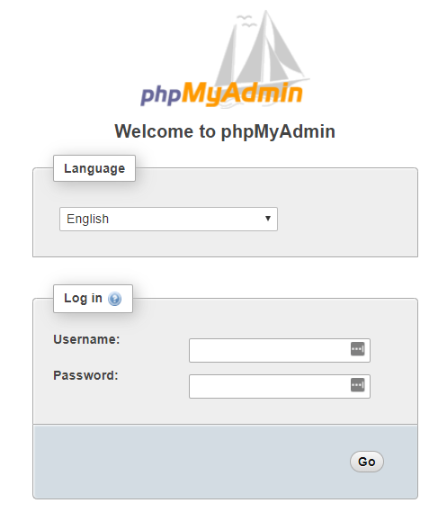

# SENDING ESP32 DATA TO A LAMP SERVER WITH RASPBERRY PI

## Under Construction...

## Description

This repo was a practice experiment based on the awesome material presented by [Random Nerd Tutorials](https://randomnerdtutorials.com/esp32-esp8266-raspberry-pi-lamp-server/)

After setting up a LAMP server using a Raspberry Pi as shown in [this tutorial](https://randomnerdtutorials.com/raspberry-pi-apache-mysql-php-lamp-server/) and also reviewed [here](https://github.com/vgmariucci/Setting_Up_LAMP_Server_With_Raspberry_Pi), we can build some **php** scripts/APIs to receive data from an ESP32 using **HTTP** protocol and **POST** method

## Requirements and Modifications to test this Repo

1- ESP32 WROOM developer board (DOIT ESP32 DEVKIT V1)

2- Raspberry Pi (3 B+)

3- Inclusion of a .env file to store sensible info used to grant access to applications.

4- Install **php**, **composer**, and **vlucas/phpdotenv** library into the Raspberry Pi to use .env file info. 

Note: If you've already set up the LAMP server into Raspberry, then install **composer** only.

**commands**

raspberrypi_user@your_raspberrypi_IP: ~ $ sudo apt install php

raspberrypi_user@your_raspberrypi_IP: ~ $ sudo apt install composer

raspberrypi_user@your_raspberrypi_IP: ~ $ sudo composer require vlucas/phpdotenv

## ESP32 Circuit Setup Used in this Project

The complete circuit is composed by following components and modules:

- DOIT ESP32 DEVKIT V1
- DHT22
- SD Card Module
- Oled Display SSD1306
- Real Time Clock Module (RTC DS3231)
- 2 Push Buttons
- 3 10 kohm resistors

The circuit setup is shown below:

### Circuit Functionality

This circuit monitors the DHT22 sensor readings at intervals, adjusted directly in the firmware (this could be improved to be adjustable in the future, using a menu approach just to set the main parameters of the system). The DHT22 readings are logged into an SD Card accompaining some other parameters like the RTC date and time, localization of installation, etc. The same data logged into the SD Card is sent using the HTTP POST method to the LAMP server running in the Raspberry Pi, which saves the data into a MariaDB/MySQL database.

The project was developed using **Arduino IDE 2.3.4** and all sketches are found in **arduino_files** directory.

## Accessing the phpMyAdmin to Create the Database to Store the Data from ESP32

Once we have the LAMP server installed and running in Raspberry Pi, we can access the server address by typing in the browser the following:

**http://you_raspberypi_IP_address/phpmyadmin**

When you press Enter, the access page will be shown:

To get access, you must fill out the field **Username** (generally **root**) and the **Password** you set during the LAMP server installation. If everything goes nicely you will see the following page:

Click on **New** to create a new database:

Choose a database name and then click in **Create**:

You will see a new database with the name you gave to it:

Now, we need to create a table to store all the ESP32 data in a structured manner(columns). To do so, we can click on the tab **SQL**:

Then, type in or just copy and paste the following SQL commands to create our desired table and click **Go**:

[verbose]SQL(
CREATE TABLE sensor_readings (
    id INT(6) UNSIGNED AUTO_INCREMENT PRIMARY KEY,
    reading_time TIMESTAMP,
    location VARCHAR(30) NOT NULL,
    temperature VARCHAR(10),
    humidity VARCHAR(10),
    wifi_status VARCHAR(10)
    )
)

You'll see the message below and the newly created table:

If we click on the table, we can see its columns, but of course, the table is empty because no data has been inputted or sent yet.

## Creating The Files Responsible to Deal With The Data Sent By The ESP32

